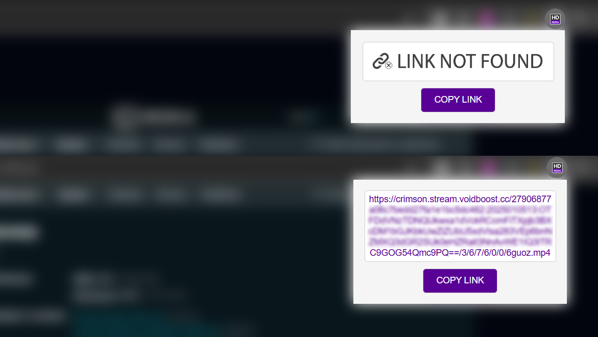

<div align="center">

  <h1>HDrezka Helper</h1>

</div>

<div align="justify">

   **HDrezka Helper** is a Google Chrome extension for HDrezka website. It automatically blocks ads and extracts direct links to movies, providing convenient access to content without distracting elements.

   The principle of operation is to track network requests that occur on the page while the video is loading. The extension determines the link to the movie being played, excluding unnecessary elements such as advertising banners and videos. The received link is transferred to the extension interface, from where it can be easily copied or used for its intended purpose. All this happens in the background, without interfering with the main viewing.

   The advantages of the **HDrezka Helper** extension are its simplicity and ease of use. The application uses a lightweight interface and tasks do not require strict settings.

<br>
</div>

<p align="center">
  
  <br>
</p>

<br>
<div align="center">

   # Settings

<div align="left">

   1. Select *"Download ZIP"* to download the repository archive or run the following command in the terminal:

      ```
         git clone https://github.com/lazycatcoder/HDRezka-Helper.git
      ```

   3. Unzip the downloaded archive to any folder on your computer

   4. Open a browser and type `chrome://extensions/` in the address bar

   5. Enable *"Developer mode"* by clicking the toggle in the top right corner of the screen

   6. Click on the button *"Load unpacked extension"*

   7. Select the folder where you unpacked the repository and click *"Select Folder"*

   8. The extension must be installed in the browser and ready to use 🚀

   <br>

   ❗Please note that installing the extension requires the **Chrome** browser or a fork of it *(such as **Chromium**)*, and that the installation procedure may differ depending on your operating system and browser version.

</div>

<br>

### 🔴 Additional Information
<div align="justify">

For flexible customization and support for new domains or features, you can optionally extend the following fields in the **manifest.json** file: 
- *permissions*
- *content_scripts.matches*

After making changes to the manifest or any other file of this extension, you must restart the extension.

</div>

</div>

